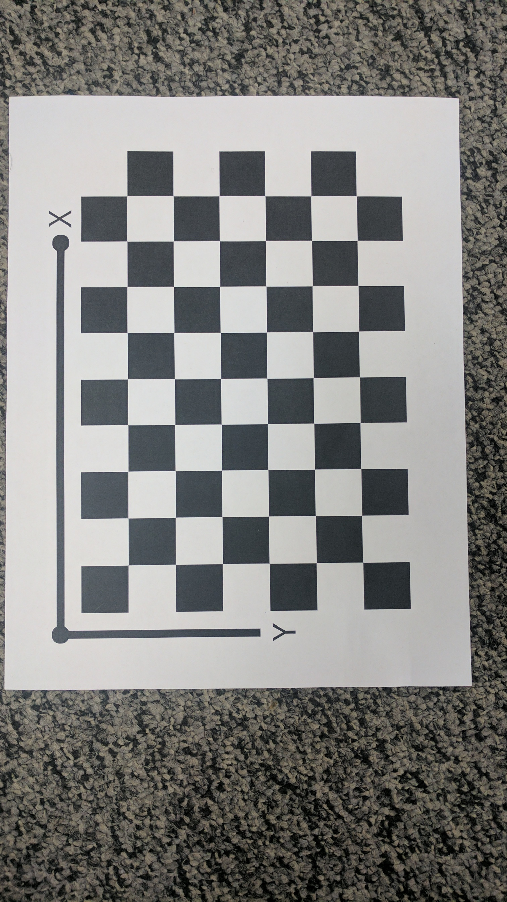
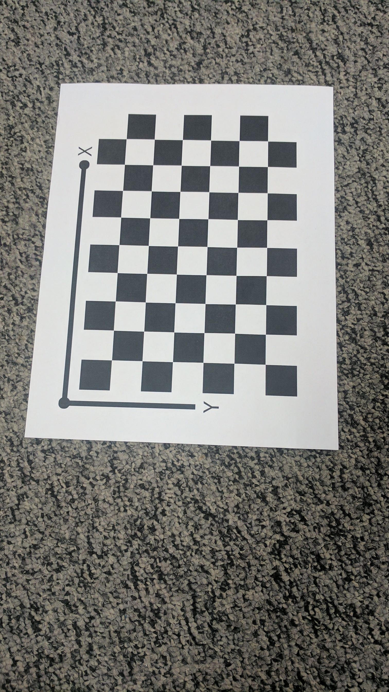

Zhang's Camera Calibration
---
Complete python implementation of camera intrinsics calibration module based on the [Zhang's seminal paper](https://www.microsoft.com/en-us/research/wp-content/uploads/2016/02/tr98-71.pdf) on auto calibration

## Images before &amp; after rectification 
<p float="middle">
  
   
</p>

<p float="middle">
  
   
</p>

## To Run
```
python code/Wrapper.py
```

## Intrinsics including distortion estimates
Initial estimate:
```
camera matrix: [[ 2.05385953e+03 -5.57111936e-01  7.62314384e+02]
                [ 0.00000000e+00  2.03798105e+03  1.35161472e+03]
                [ 0.00000000e+00  0.00000000e+00  1.00000000e+00]]

distortion coefficients: 
                [0.0,0.0]
```

Final estimates after nonlinear optimization:
```
camera_matrix: [[ 2.04890946e+03 -1.81820384e+00  7.57250677e+02]
                [ 0.00000000e+00  2.04013918e+03  1.34345822e+03]
                [ 0.00000000e+00  0.00000000e+00  1.00000000e+00]]

distortion coefficients: 
                [0.16892840826939845,-0.7347718067455832]
```

Projection errors before and after nonlinear optimization

Image | #1 | #2 | #3 | #4 | #5 | #6 | #7 | #8 | #9 | #10 | #11 | #12 | #13 |
--- | --- | --- | --- |--- |--- |--- |--- |--- |--- |--- |---|--- |--- |
Before | 2.41 | 1.14 | 1.68 | 0.82 |  2.29 | 1.19|  5.93|  1.17|  1.96|  2.00|  1.37|  3.32|  2.12 |
After | 0.71|  0.43|  0.59|  0.56|  0.96|  0.82|  0.85|  0.65|  0.49|  0.54|  0.72|  0.80|  0.54|

